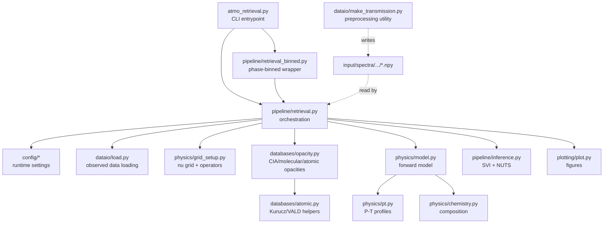

# atmo-retrieval

bayesian atmospheric retrieval for high-resolution exoplanet spectra

## install

```bash
pip install jax numpyro exojax astropy matplotlib corner
```

## cli

```bash
# Transmission retrieval
python -m atmo_retrieval --planet KELT-20b --mode transmission --epoch 20250601

# Emission retrieval with explicit P-T profile
python -m atmo_retrieval --planet WASP-76b --mode emission --epoch 20240315 --pt-profile guillot

# Quick smoke run
python -m atmo_retrieval --planet KELT-20b --mode transmission --epoch 20250601 --quick
```

## code structure



## expected input directory structure

```
input/spectra/{planet}/{epoch}/{arm}/
  wavelength.npy
  data.npy
  sigma.npy
  phase.npy
```

## outputs

```
output/{planet}/{ephemeris}/{mode}/{timestamp}/
  run_config.log
  mcmc_summary.txt
  posterior_sample.npz
  atmospheric_state.npz
  contribution_function.pdf
```
