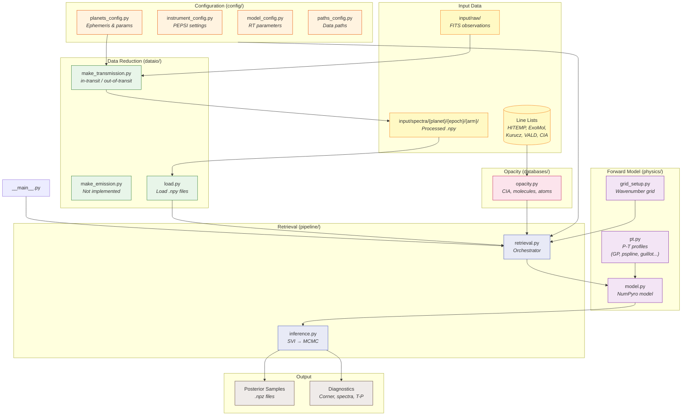

# Atmospheric Retrieval

Bayesian atmospheric retrieval for exoplanet transmission and emission spectra.

## Installation

```bash
pip install -e .
```

Requires JAX, NumPyro, ExoJAX, and standard scientific Python packages.

## Quick Start

### Command Line Interface

```bash
# Basic transmission retrieval
python -m atmo-retrieval \
    --planet KELT-20b \
    --mode transmission \
    --epoch 20250601

# Emission retrieval with custom settings
python -m atmo-retrieval \
    --planet WASP-76b \
    --mode emission \
    --epoch 20240315 \
    --pt-profile gp \
    --svi-steps 2000 \
    --mcmc-samples 2000

# Quick test run (100 SVI steps, 100 MCMC samples)
python -m atmo-retrieval \
    --planet KELT-20b \
    --mode transmission \
    --epoch 20250601 \
    --quick

# Select specific species
python -m atmo-retrieval \
    --planet KELT-20b \
    --mode transmission \
    --epoch 20250601 \
    --molecules H2O,CO \
    --atoms "Fe I,Na I"

# Phase-binned retrieval (ingress/full/egress)
python -m atmo-retrieval \
    --planet KELT-20b \
    --mode transmission \
    --epoch 20250601 \
    --all-phase-bins

# List available planets and ephemerides
python -m atmo-retrieval --list-planets --planet KELT-20b
python -m atmo-retrieval --list-ephemerides --planet KELT-20b
```

### Python API

```python
from pipeline.retrieval import run_retrieval

# Run a transmission retrieval
run_retrieval(
    mode="transmission",
    epoch="20250601",
    pt_profile="gp",           # Gaussian Process P-T profile
    phase_mode="shared",       # Single dRV for all exposures
    skip_svi=False,
    svi_only=False,
    seed=42,
)
```

## Usage Examples

### Configuration

```python
import config

# Get planet parameters
params = config.get_params()
print(f"Planet: {config.PLANET}")
print(f"Period: {params['period']} days")
print(f"R_p: {params['R_p']} R_J")
print(f"T_eq: {params['T_eq']} K")

# List available planets and ephemerides
planets = config.list_planets()
ephemerides = config.list_ephemerides("KELT-20b")

# Get instrument settings
R = config.get_resolution()
wav_min, wav_max = config.get_wavelength_range()

# Get data paths
data_dir = config.get_data_dir(epoch="20250601")
trans_paths = config.get_transmission_paths(epoch="20250601")
output_dir = config.get_output_dir()
```

### Data Loading

```python
from dataio.load import load_observed_spectrum, ResolutionInterpolator

# Load spectrum from .npy files
wav_obs, spectrum, uncertainty, inst_nus = load_observed_spectrum(
    wav_path="input/spectra/KELT-20b/20250601/red/wavelength.npy",
    spectrum_path="input/spectra/KELT-20b/20250601/red/spectrum.npy",
    uncertainty_path="input/spectra/KELT-20b/20250601/red/uncertainty.npy",
)

# Create resolution interpolator
res_interp = ResolutionInterpolator(constant_R=130000)
# Or from a resolution curve file:
# res_interp = ResolutionInterpolator(res_curve_path="resolution.fits")
```

### Opacity Setup

```python
import numpy as np
from databases.opacity import (
    setup_cia_opacities,
    load_molecular_opacities,
    load_atomic_opacities,
)
import config

# Define wavenumber grid
nu_grid = np.linspace(5000, 25000, 200000)  # cm^-1

# Load CIA opacities (H2-H2, H2-He)
opa_cias = setup_cia_opacities(config.CIA_PATHS, nu_grid)

# Load molecular opacities (HITEMP/ExoMol)
opa_mols, molmass_arr = load_molecular_opacities(
    molpath_hitemp={"H2O": "path/to/H2O", "CO": "path/to/CO"},
    molpath_exomol={"TiO": "path/to/TiO"},
    nu_grid=nu_grid,
    opa_load=True,      # Use cached opacities if available
    ndiv=250,           # Wavenumber stitching divisions
    diffmode=0,         # Forward-mode differentiation
    T_low=1500,
    T_high=4500,
)

# Load atomic opacities (Kurucz/VALD)
opa_atoms, atommass_arr = load_atomic_opacities(
    atomic_species={"Fe I": {}, "Na I": {}, "Ca II": {}},
    nu_grid=nu_grid,
    opa_load=True,
    ndiv=250,
    diffmode=0,
    T_low=1500,
    T_high=4500,
)
```

### Forward Model Creation

```python
from exojax.rt import ArtTransPure
from physics.model import create_retrieval_model
from physics.grid_setup import setup_wavenumber_grid, setup_spectral_operators

# Setup wavenumber grid
nu_grid, wav_grid, res_high = setup_wavenumber_grid(
    wav_min=4800,   # Angstroms
    wav_max=6800,
    n_points=250000,
    unit="AA",
)

# Setup spectral operators (rotation, instrumental broadening)
sop_rot, sop_inst, _ = setup_spectral_operators(
    nu_grid,
    Rinst=130000,
    vsini_max=150.0,
    vrmax=500.0,
)

# Initialize radiative transfer
art = ArtTransPure(
    pressure_top=1e-8,
    pressure_btm=1e2,
    nlayer=100,
)
art.change_temperature_range(1500, 4500)

# Create the NumPyro retrieval model
model = create_retrieval_model(
    mode="transmission",
    params={
        "Kp": 150.0,
        "RV_abs": 0.0,
        "R_p": 1.8,
        "M_p": 3.5,
        "R_star": 1.6,
        "T_star": 8700,
        "period": 3.47,
    },
    art=art,
    opa_mols=opa_mols,
    opa_atoms=opa_atoms,
    opa_cias=opa_cias,
    nu_grid=nu_grid,
    sop_rot=sop_rot,
    sop_inst=sop_inst,
    instrument_resolution=130000,
    inst_nus=inst_nus,
    pt_profile="gp",        # Options: isothermal, gradient, guillot, gp, pspline, free
    phase_mode="shared",    # Options: shared, per_exposure, hierarchical, linear, quadratic
)
```

### Bayesian Inference

```python
import jax
from jax import random
import jax.numpy as jnp
from numpyro.infer import MCMC, NUTS
from pipeline.inference import run_svi, run_mcmc, generate_predictions

# Prepare data
data_jnp = jnp.array(data)       # (n_exposures, n_wavelengths)
sigma_jnp = jnp.array(sigma)
phase_jnp = jnp.array(phase)

rng_key = random.PRNGKey(42)

# Option 1: Direct MCMC
kernel = NUTS(model, max_tree_depth=5)
mcmc = MCMC(kernel, num_warmup=1000, num_samples=1000, num_chains=1)
mcmc.run(rng_key, data=data_jnp, sigma=sigma_jnp, phase=phase_jnp)

posterior_samples = mcmc.get_samples()
mcmc.print_summary()

# Option 2: SVI warm-up + MCMC (for complex models)
svi_params, losses, init_strategy, svi_median, guide = run_svi(
    model_c=model,
    rng_key=rng_key,
    rp_mean=data_jnp.mean(axis=0),
    rp_std=sigma_jnp.mean(axis=0),
    Mp_mean=3.5,
    Mp_std=0.5,
    Rstar_mean=1.6,
    Rstar_std=0.1,
    output_dir="./output",
    num_steps=1000,
    lr=0.005,
)

mcmc, posterior_samples = run_mcmc(
    model_c=model,
    rng_key=rng_key,
    rp_mean=data_jnp.mean(axis=0),
    rp_std=sigma_jnp.mean(axis=0),
    init_strategy=init_strategy,
    output_dir="./output",
    num_warmup=1000,
    num_samples=1000,
)

# Generate predictive spectra
predictions = generate_predictions(
    model_c=model,
    rng_key=rng_key,
    posterior_sample=posterior_samples,
    rp_std=sigma_jnp.mean(axis=0),
    output_dir="./output",
)
```

### Plotting and Diagnostics

```python
from plotting.plot import (
    plot_svi_loss,
    plot_transmission_spectrum,
    plot_temperature_profile,
    plot_corner,
    plot_contribution_function,
)

# Plot SVI convergence
plot_svi_loss(losses, save_path="output/svi_loss.pdf")

# Plot transmission spectrum
plot_transmission_spectrum(
    wavelength_nm=wav_obs / 10,  # Convert Angstroms to nm
    rp_obs=data.mean(axis=0),
    rp_err=sigma.mean(axis=0),
    rp_hmc=predictions["rp"],
    rp_svi=svi_median_spectrum,
    save_path="output/transmission_spectrum.pdf",
)

# Plot T-P profile
plot_temperature_profile(
    posterior_samples=posterior_samples,
    art=art,
    save_path="output/tp_profile.pdf",
)

# Plot contribution function
plot_contribution_function(
    nu_grid=nu_grid,
    dtau=atmospheric_state["dtau"],
    Tarr=atmospheric_state["Tarr"],
    pressure=atmospheric_state["pressure"],
    dParr=atmospheric_state["dParr"],
    save_path="output/contribution_function.pdf",
    wavelength_unit="AA",
)
```

### P-T Profile Options

```python
from physics.pt import (
    numpyro_isothermal,
    numpyro_gradient,
    guillot_profile,
    numpyro_gp_temperature,
    numpyro_pspline_knots_on_art_grid,
    numpyro_free_temperature,
)

# Available P-T profile types (set via pt_profile parameter):
# - "isothermal": Constant temperature
# - "gradient": Linear in log-P
# - "guillot": Radiative-convective equilibrium
# - "gp": Gaussian Process prior (recommended)
# - "pspline": Piecewise spline
# - "free": Free parameters per layer
```

## Data Format

### Input Files

Expected directory structure:
```
input/spectra/{planet}/{epoch}/{arm}/
├── wavelength.npy    # (n_wavelengths,) in Angstroms
├── data.npy          # (n_exposures, n_wavelengths) flux
├── sigma.npy         # (n_exposures, n_wavelengths) uncertainties
└── phase.npy         # (n_exposures,) orbital phase [0, 1]
```

### Output Files

```
output/{planet}/{ephemeris}/{mode}/{timestamp}/
├── run_config.log           # Full configuration
├── mcmc_summary.txt         # MCMC diagnostics
├── posterior_sample.npz     # Posterior samples
├── atmospheric_state.npz    # T, P, VMR profiles
├── contribution_function.pdf
├── corner.pdf
└── transmission_spectrum.pdf
```

## Architecture


