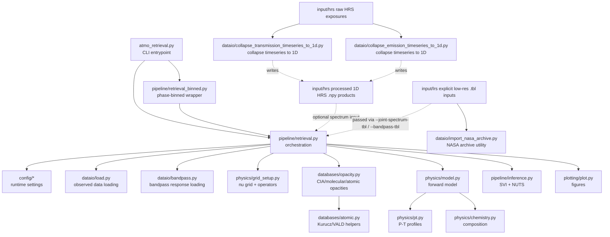

# atmo-retrieval

bayesian atmospheric retrieval for high-resolution exoplanet spectra

## install

```bash
pip install jax numpyro exojax astropy matplotlib corner
```

## cli

```bash
python -m atmo_retrieval --planet KELT-20b --mode transmission --epoch 20250601
```

Low-resolution inputs are passed explicitly:
- use `--joint-spectrum-tbl path/to/file.tbl` for multi-bin low-res spectra
- use `--bandpass-tbl path/to/file.tbl` for single-band / sparse broadband constraints
- paths can be full paths or relative to `input/lrs`, e.g. `kelt20b/file.tbl`

## joint retrieval bandpass constraints

```bash
# bandpass constraints are added through pipeline.retrieval
# using build_bandpass_observation_config / bandpass_constraints
```

## code structure


```mermaid
flowchart TD
    A[atmo_retrieval.py<br/>CLI entrypoint] --> B[pipeline/retrieval.py<br/>orchestration]
    A --> M[pipeline/retrieval_binned.py<br/>phase-binned wrapper]
    M --> B

    B --> C[config/*<br/>runtime settings]
    B --> D[dataio/load.py<br/>observed data loading]
    B --> D2[dataio/bandpass.py<br/>bandpass response loading]
    B --> E[physics/grid_setup.py<br/>nu grid + operators]
    B --> F[databases/opacity.py<br/>CIA/molecular/atomic opacities]
    F --> G[databases/atomic.py<br/>Kurucz/VALD helpers]
    B --> H[physics/model.py<br/>forward model]
    H --> I[physics/pt.py<br/>P-T profiles]
    H --> J[physics/chemistry.py<br/>composition]
    B --> K[pipeline/inference.py<br/>SVI + NUTS]
    B --> L[plotting/plot.py<br/>figures]

    N[input/hrs raw HRS exposures] --> O[dataio/collapse_transmission_timeseries_to_1d.py<br/>collapse timeseries to 1D]
    N --> P[dataio/collapse_emission_timeseries_to_1d.py<br/>collapse timeseries to 1D]
    O -. writes .-> Q[input/hrs processed 1D HRS .npy products]
    P -. writes .-> Q
    Q -. optional spectrum input .-> B

    R[input/lrs explicit low-res .tbl inputs] --> S[dataio/import_nasa_archive.py<br/>NASA archive utility]
    R -. passed via --joint-spectrum-tbl / --bandpass-tbl .-> B
```

modules:

```text
.
├── atmo_retrieval.py
├── config
│   ├── __init__.py
│   ├── chemistry_config.py
│   ├── data_config.py
│   ├── inference_config.py
│   ├── instrument_config.py
│   ├── model_config.py
│   ├── paths_config.py
│   ├── planets_config.py
│   ├── photometry_config.py
│   └── tellurics_config.py
├── databases
│   ├── atomic.py
│   └── opacity.py
├── dataio
│   ├── bandpass.py
│   ├── import_nasa_archive.py
│   ├── load.py
│   ├── collapse_emission_timeseries_to_1d.py
│   ├── collapse_transmission_timeseries_to_1d.py
│   └── tellurics.py
├── environment.yml
├── physics
│   ├── chemistry_draft.py
│   ├── chemistry.py
│   ├── grid_setup.py
│   ├── model.py
│   └── pt.py
├── pipeline
│   ├── inference.py
│   ├── memory_profile.py
│   ├── retrieval_binned.py
│   └── retrieval.py
├── plotting
│   ├── __init__.py
│   ├── aliasing.py
│   └── plot.py
└── tests
```

## expected input directory structure

```
input/hrs/{planet}/{epoch}/{arm}/
  wavelength_transmission.npy
  spectrum_transmission.npy
  uncertainty_transmission.npy

input/hrs/{epoch}_{planet}/
  ... raw PEPSI files ...

input/lrs/{planet}/
  *.tbl
  *.dat
  *.csv
```

## outputs

```
output/{planet}/{ephemeris}/{mode}/{timestamp}/
  run_config.log
  mcmc_summary.txt
  posterior_sample.npz
  atmospheric_state.npz
  contribution_function.pdf
```
