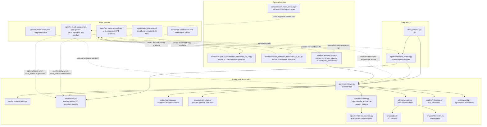

# atmo-retrieval

bayesian atmospheric retrieval for high-resolution exoplanet spectra

## install

```bash
pip install jax numpyro exojax astropy matplotlib corner
```

## cli

```bash
python -m atmo_retrieval --planet KELT-20b --mode transmission --epoch 20250601
```

Low-resolution inputs are passed explicitly:
- use `--joint-spectrum-tbl path/to/file.tbl` for multi-bin low-res spectra
- use `--bandpass-tbl path/to/file.tbl` for single-band / sparse broadband constraints
- `--joint-spectrum-tbl` paths can be full paths or relative to `input/lrs`, canonical form `transmission/kelt9b/file.tbl` or `emission/kelt20b/file.tbl`
- `--bandpass-tbl` paths can be full paths or relative to `input/phot`, canonical form `transmission/kelt20b/file.tbl` or `emission/kelt9b/file.tbl`

## joint retrieval bandpass constraints

```bash
# bandpass constraints are added through pipeline.retrieval
# using build_bandpass_observation_config / bandpass_constraints
```

## code structure


```mermaid
flowchart TD
    subgraph EP[Entry points]
        A[atmo_retrieval.py<br/>CLI]
        M[pipeline/retrieval_binned.py<br/>phase-binned wrapper]
    end

    subgraph DS[Data sources]
        T1[input/hrs mode-scoped raw and processed HRS products]
        T2[input/lrs mode-scoped low-res spectra<br/>.tbl or imported .npy bundles]
        T3[input/phot mode-scoped broadband constraint .tbl files]
        T4[reference bandpasses and abundance tables]
        T5[direct Python arrays and component dicts]
    end

    subgraph UT[Optional utilities]
        U1[dataio/collapse_transmission_timeseries_to_1d.py<br/>derive 1D transmission spectrum]
        U2[dataio/collapse_emission_timeseries_to_1d.py<br/>derive 1D emission spectrum]
        U3[dataio/import_nasa_archive.py<br/>NASA archive import helper]
        X[pipeline.retrieval helpers<br/>convert .tbl to joint_spectra or bandpass_constraints]
    end

    subgraph RT[Runtime retrieval path]
        B[pipeline/retrieval.py<br/>orchestration]
        C[config runtime settings]
        D[dataio/load.py<br/>time-series and 1D spectrum loaders]
        D2[dataio/bandpass.py<br/>bandpass response loader]
        E[physics/grid_setup.py<br/>spectral grid and operators]
        F[opacities/loader.py<br/>CIA molecular and atomic opacity loaders]
        G[opacities/atomic_sources.py<br/>Kurucz and VALD helpers]
        H[physics/model.py<br/>joint forward model]
        I[physics/pt.py<br/>P-T profiles]
        J[physics/chemistry.py<br/>composition]
        K[pipeline/inference.py<br/>SVI and NUTS]
        L[plotting/plot.py<br/>figures and summaries]
    end

    A --> B
    A --> M
    M --> D
    M --> B

    B --> C
    B --> D
    B --> D2
    B --> E
    B --> F
    F --> G
    B --> H
    H --> I
    H --> J
    B --> K
    B --> L

    T1 -. used directly when data_format is timeseries .-> D
    T1 -. timeseries only .-> M
    T2 -. optional input when data_format is spectrum .-> D
    T2 -. passed via joint-spectrum-tbl .-> X
    T3 -. passed via bandpass-tbl .-> X
    T4 -. static response and abundance assets .-> B
    X --> B
    T5 -. optional programmatic entry .-> B

    T1 --> U1
    T1 --> U2
    U1 -. writes derived 1D npy products .-> T1
    U2 -. writes derived 1D npy products .-> T1
    U3 -. writes imported archive files .-> T2
```

- Solid arrows: normal code dependencies or execution flow.
- Dashed arrows: optional inputs, helper conversions, or derived products.
- The collapse-to-1D scripts are utilities for the `spectrum` path only; they are not required for the principal `timeseries` path.

modules:

```text
.
├── atmo_retrieval.py
├── config
│   ├── __init__.py
│   ├── chemistry_config.py
│   ├── data_config.py
│   ├── inference_config.py
│   ├── instrument_config.py
│   ├── model_config.py
│   ├── paths_config.py
│   ├── planets_config.py
│   ├── photometry_config.py
│   └── tellurics_config.py
├── opacities
│   ├── __init__.py
│   ├── atomic_sources.py
│   └── loader.py
├── dataio
│   ├── bandpass.py
│   ├── import_nasa_archive.py
│   ├── load.py
│   ├── collapse_emission_timeseries_to_1d.py
│   ├── collapse_transmission_timeseries_to_1d.py
│   └── tellurics.py
├── environment.yml
├── physics
│   ├── chemistry_draft.py
│   ├── chemistry.py
│   ├── grid_setup.py
│   ├── model.py
│   └── pt.py
├── pipeline
│   ├── inference.py
│   ├── memory_profile.py
│   ├── retrieval_binned.py
│   └── retrieval.py
├── plotting
│   ├── __init__.py
│   ├── aliasing.py
│   └── plot.py
└── tests
```

## expected input directory structure

```
input/hrs/{mode}/{planet}/{epoch}/{arm}/
  wavelength_{mode}.npy
  spectrum_{mode}.npy
  uncertainty_{mode}.npy

input/hrs/{mode}/raw/{planet}/{epoch}/
  ... raw PEPSI files ...

input/lrs/{mode}/{planet}/
  *.tbl
  {spec_num}/
    wavelength_{mode}.npy
    spectrum_{mode}.npy
    uncertainty_{mode}.npy
    metadata.json

input/lrs/{mode}/raw/{planet}/
  hst_wfc3_ir_g102_pid17082/
    IF0L02RCQ/
      if0l02rcq_flt.fits
      ...
  ... other source archive bundles / auxiliary tables ...

input/phot/{mode}/{planet}/
  *.tbl

input/phot/{mode}/raw/{planet}/
  ... cadence-level photometry or upstream fit products ...

reference/bandpasses/
  tess-response-function-v2.0.csv

reference/abundances/
  asplund_2020_extended.dat

cache/phoenix/
cache/opacity/

db/
  hitemp/
  exomol/
  exoatom/
  kurucz/
  vald/
  cia/
```

## outputs

```
output/{planet}/{ephemeris}/{mode}/{timestamp}/
  run_config.log
  mcmc_summary.txt
  posterior_sample.npz
  atmospheric_state.npz
  contribution_function.pdf
```
