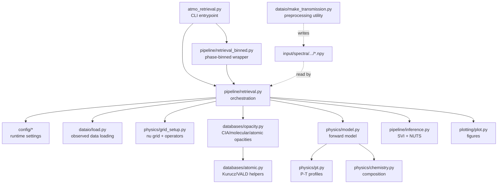

# atmo-retrieval

bayesian atmospheric retrieval for high-resolution exoplanet spectra

## install

```bash
pip install jax numpyro exojax astropy matplotlib corner
```

## cli

```bash
python -m atmo_retrieval --planet KELT-20b --mode transmission --epoch 20250601
```

## code structure


```mermaid
flowchart TD
    A[atmo_retrieval.py<br/>CLI entrypoint] --> B[pipeline/retrieval.py<br/>orchestration]

    B --> C[config/*<br/>runtime settings]
    B --> D[dataio/load.py<br/>observed data loading]
    B --> E[physics/grid_setup.py<br/>nu grid + operators]
    B --> F[databases/opacity.py<br/>CIA/molecular/atomic opacities]
    F --> G[databases/atomic.py<br/>Kurucz/VALD helpers]
    B --> H[physics/model.py<br/>forward model]
    H --> I[physics/pt.py<br/>P-T profiles]
    H --> J[physics/chemistry.py<br/>composition]
    B --> K[pipeline/inference.py<br/>SVI + NUTS]
    B --> L[plotting/plot.py<br/>figures]

    A --> M[pipeline/retrieval_binned.py<br/>phase-binned wrapper]
    M --> B

    N[dataio/make_transmission.py<br/>preprocessing utility] -. writes .-> O[input/spectra/.../*.npy]
    O -. read by .-> B
```

Filtered repository tree (code-focused):

```text
.
├── atmo_retrieval.py
├── config
│   ├── __init__.py
│   ├── chemistry_config.py
│   ├── data_config.py
│   ├── inference_config.py
│   ├── instrument_config.py
│   ├── model_config.py
│   ├── paths_config.py
│   ├── planets_config.py
│   └── tellurics_config.py
├── databases
│   ├── atomic.py
│   └── opacity.py
├── dataio
│   ├── import_nasa_archive.py
│   ├── load.py
│   ├── make_emission.py
│   ├── make_transmission.py
│   └── tellurics.py
├── environment.yml
├── physics
│   ├── chemistry_draft.py
│   ├── chemistry.py
│   ├── grid_setup.py
│   ├── model.py
│   └── pt.py
├── pipeline
│   ├── inference.py
│   ├── memory_profile.py
│   ├── retrieval_binned.py
│   └── retrieval.py
├── plotting
│   ├── __init__.py
│   ├── aliasing.py
│   └── plot.py
└── tests
    └── memory_profile.py
```

## expected input directory structure

```
input/spectra/{planet}/{epoch}/{arm}/
  wavelength.npy
  data.npy
  sigma.npy
  phase.npy
```

## outputs

```
output/{planet}/{ephemeris}/{mode}/{timestamp}/
  run_config.log
  mcmc_summary.txt
  posterior_sample.npz
  atmospheric_state.npz
  contribution_function.pdf
```
