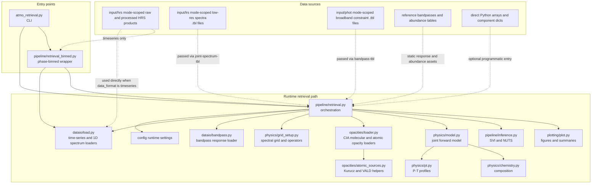

# atmo-retrieval

bayesian atmospheric retrieval for high-resolution exoplanet spectra

## install

```bash
pip install jax numpyro exojax astropy matplotlib corner
```

## Command-line workflows

Repeatable diagnostics and acquisition run without Jupyter:

```bash
# Prepared HRS products, including both timeseries and collapse-source bundles.
conda run -n retrieval python scripts/render_hrs_product_diagnostics.py \
  --planet KELT-20b --mode transmission --product both

# Cross-product spectral-processing diagnostics.
conda run -n retrieval python scripts/render_spectral_processing_diagnostics.py \
  --planet KELT-20b --mode transmission

# Discover or run raw-exposure edge-trim calibrations. These commands write
# diagnostic proposals only; they never regenerate prepared arrays.
conda run -n retrieval python scripts/run_edge_trim_calibrations.py --list
conda run -n retrieval python scripts/run_edge_trim_calibrations.py \
  --planet KELT-20b --mode transmission

# TESS transit fit and retrieval-ready bandpass table.
conda run -n retrieval python scripts/run_tess_transit.py --planet KELT-20b

# Download the exact checked-in HST selection.
conda run -n retrieval python scripts/download_mast_products.py \
  --output-dir output/mast/hst-selection

# Reconstruct figures from a completed retrieval.
conda run -n retrieval python scripts/render_retrieval_diagnostics.py \
  --run-dir output/kelt20b/Duck24/transmission/2026-04-02_03-53-01
```

TESS fitting is intentionally separate from retrieval. Pass the generated
`tess_bandpass.tbl` to `atmo_retrieval.py` with `--bandpass-tbl`.

Edge-trim calibration tests 0--20 nm on a 0.1 nm grid, refines acceptance and
rejection transitions at 0.02 nm, and reruns SYSREM for as many as 256
least-trim finalist pairs. Results are timestamped beneath
`diagnostics/edge_trim_calibration/`. Only `accepted_post_sysrem` rows are
acceptance-grade, and every manifest records
`canonical_generation_authorized=false` and `prepared_arrays_written=false`.
Use `--dry-run` with any `--planet`, `--mode`, `--epoch`, or `--arm` filters to
inspect the exact datasets before starting the long calculation.

Generate the frozen intrinsic PySME spectrum, then measure the stellar velocity
zero point before preparing KELT-20 spectra. Template provenance is documented
in `reference/stellar_lsd_templates/README.md`.

```bash
conda run -n retrieval python scripts/generate_pysme_stellar_template.py \
  --planet KELT-20b \
  --linelist input/vald/CalderLenhart.021791 \
  --output reference/stellar_lsd_templates/kelt20b_pysme_lte_vacuum.npz
```

```bash
conda run -n retrieval python scripts/measure_stellar_velocity_lsd.py \
  --planet KELT-20b --ephemeris Duck24 --mode both \
  --template reference/stellar_lsd_templates/kelt20b_pysme_lte_vacuum.npz \
  --edge-trim-calibration-root diagnostics/edge_trim_calibration
```

The LSD rotational-profile fit uses only the quadratic law
`I(mu) = 1 - gamma1*(1-mu) - gamma2*(1-mu)^2`. Both coefficients are required;
there is no single-coefficient linear fallback.

Systemic-velocity measurements use the blue arm only. Red-arm spectra are not
loaded, combined, or used as a fallback when a blue-arm measurement fails.

This reconstructs a barycentric vacuum wavelength grid from each PEPSI FITS
header, measures one LSD RV per blue-arm exposure, and fits
`gamma + K_star sin(2 pi phase)` across epochs. Transmission spectra
between first and fourth contact are excluded by default because their line
profiles contain the Rossiter-McLaughlin distortion. Pass
`--include-in-transit` only for a deliberate diagnostic.

The command always writes diagnostics and a `stellar_velocity_lsd.json` beside
each processed epoch. A result is accepted for automatic stellar-rest use when
the blue-arm profile checks pass. Its final `systemic_velocity_err_kms` is the
fitted statistical uncertainty by default.
No error floor is imposed. An optional floor can be requested explicitly with
`--systematic-error-floor-kms`. A QC failure returns exit status 2 and remains
diagnostic-only. Preparation ignores an unaccepted result, leaves wavelengths
barycentric, and records the decision in `timeseries_prep.json`.

To reproduce the three-dataset sampling described by Petz et al. (2023):

```bash
conda run -n retrieval python scripts/measure_stellar_velocity_lsd.py \
  --planet KELT-20b --ephemeris Duck24 --mode both \
  --epoch 20190504 --epoch 20210501 --epoch 20210518 \
  --template reference/stellar_lsd_templates/kelt20b_pysme_lte_vacuum.npz \
  --edge-trim-calibration-root diagnostics/edge_trim_calibration \
  --output-dir diagnostics/stellar_velocity/kelt20b/pysme_petz2023
```

The estimator deconvolves a full disk-integrated PySME spectrum generated from
the raw VALD atomic data. Agreement with the Petz et al. published
`-22.78 +/- 0.11 km/s` PEPSI-frame value is a validation target, not an offset
to insert. Any discrepancy remains visible in the fitted jitter and residual
diagnostics rather than being shifted to the published answer.

```bash
# Prepare raw exposure folders for a transmission retrieval.
python -m dataio.prepare_retrieval_timeseries \
  --planet KELT-20b --epoch 20250601 --arm full --run-sysrem

# Prepare emission time-series retrieval inputs.
python -m dataio.prepare_emission_retrieval_timeseries \
  --planet KELT-20b --epoch 20250601 --arm full --run-sysrem

# Prepare the dedicated all-exposure source cubes for 1D retrievals.
python -m dataio.prepare_retrieval_timeseries \
  --planet KELT-20b --epoch 20250601 --arm full \
  --product-kind collapse-source --phase-bin all --run-sysrem
python -m dataio.prepare_emission_retrieval_timeseries \
  --planet KELT-20b --epoch 20250601 --arm full \
  --product-kind collapse-source --phase-bin all --run-sysrem

# Fit the mandatory shared-basis LSD shadow once per arm and project it onto
# both exact prepared source grids. This always enables the retrieval model.
python -m spectroscopy.doppler_shadow \
  --planet KELT-20b --ephemeris Duck24 --shadow-source Recommended \
  --epoch 20250601 --arm both

# Build the nightly 1D transmission spectrum.
python -m dataio.collapse_transmission_timeseries_to_1d \
  --planet KELT-20b --epoch 20250601 --arm full

# Build full, pre-eclipse, and post-eclipse nightly 1D emission spectra.
python -m dataio.collapse_emission_timeseries_to_1d \
  --planet KELT-20b \
  --epoch 20210501 20210518 20230430 20230615 20240516 \
  --arm full

# Combine only eligible pre-eclipse nightly spectra in one retrieval.
python -m atmo_retrieval \
  --planet KELT-20b --mode emission --data-format spectrum \
  --emission-selection pre_eclipse --wavelength-range full \
  --epoch 20210501 20210518 20230430 20230615 20240516 \
  --pt-profile guillot

# Run either prepared time-series retrieval.
python -m atmo_retrieval \
  --planet KELT-20b --mode transmission --epoch 20250601 \
  --pt-profile isothermal
```

The preparation step is unnecessary when the retrieval-ready time-series bundle
already exists.

Prepared time-series and collapsed products replay temporal preprocessing on
the complete source exposure sequence before selecting likelihood rows. The
saved frozen operator applies the visibility mask, optional time-median
subtraction, and SYSREM projection using the saved uncertainty of every
exposure/wavelength pixel. Products containing the retired `V_chunk_diag`
chunk approximation must be regenerated.

Collapsed products additionally require `collapse-source` cubes prepared with
`--phase-bin all`; their operator then performs planet-frame coaddition after
the full-exposure preprocessing above.

Mode-specific atmospheric defaults are explicit: transmission uses a
`1e-8`-`1` bar grid with an isothermal P-T profile, while emission uses a
`1e-4`-`1` bar grid with a Guillot P-T profile. Pass `--pt-profile` to override
the mode default for an individual run.
In a mixed-mode joint retrieval, the primary region keeps that run-level
selection, while each auxiliary region uses its own mode default unless its
region specification provides an explicit `pt_profile`.

Transmission radius convention is explicit: the sampled catalog-informed
radius prior is adopted as `R_ref` at `P_ref = 1 bar`, which is also the
transmission grid's lower boundary. It is passed to ExoJAX as `radius_btm`,
and the corresponding gravity is computed at that same radius. This is a
modeling convention, not a direct observational measurement of `R_1bar`; each
run records the convention in `run_config.log`.

High-resolution emission contrasts use a stationary PHOENIX denominator. The
unbroadened stellar surface spectrum is auto-fetched on first use and cached by
its exact PHOENIX parameters and model wavelength grid. Every emission run then
rotationally broadens that cached spectrum with the active target's
`v_sini_star` and `gamma1`/`gamma2`, convolves it with the same instrumental
Gaussian profile as the planet, and samples it at zero velocity. The rotation
operator automatically reserves 10% more velocity support than the configured
stellar `v_sini_star` (KELT-20b therefore uses 129.14 km/s rather than the
100 km/s floor).

SVI is used as a warm start for NUTS/HMC. `--svi-only` outputs are approximate
diagnostics, not production posterior samples.

### Image-specified HRS retrieval runners

The dedicated runners in `scripts/` encode the initial retrieval plan: a
transmission species ladder, named emission cases, and the joint
terminator+dayside likelihood. Inspect the resolved parameters and prepared
data before starting an inference run:

```bash
conda run -n retrieval python scripts/run_transmission_retrievals.py --list
conda run -n retrieval python scripts/run_transmission_retrievals.py \
  --case free_fe --epoch 20190504 --arm red --dry-run
conda run -n retrieval python scripts/run_emission_retrievals.py \
  --case fe_only_hybrid --epoch 20210518 --arm blue --dry-run
conda run -n retrieval python scripts/run_joint_retrievals.py \
  --transmission-epoch 20190504 --emission-epoch 20210501 \
  --arm red --dry-run
```

Remove `--dry-run` to launch inference. Repeat an epoch flag to combine nights,
use `--arm full` for separate red+blue likelihood components, and use `--quick`
for a short smoke retrieval. The default shared-system policy uses an
informative mass prior and fixes `Rp` and `Rstar`; pass `--radius-policy tight`
to sample their catalog normal priors instead.

Transmission free-chemistry cases use one constant VMR per listed atom and
separate Fe I/Fe II velocity offsets. `equilibrium_fe` instead samples only
`[M/H]` for the chemistry, fixes C/O to solar, and obtains Fe I/Fe II, H2, He,
continuum abundances, and mean molecular weight from the FastChem grid. It does
not create simultaneous free Fe VMR sites.

The emission runner defaults to the original constant Fe I/Na I/Ca I case and
also provides `fe_only_hybrid`, which retrieves a constant Fe I VMR while a
FastChem grid supplies H, e-, and H- continuum profiles. Use `--atoms` and
`--chemistry-model` for explicit overrides, for example
`--atoms "Fe I,Ni I,Ca I" --chemistry-model fastchem_hybrid_grid`. Hybrid cases
default to `input/fastchem/parameters.dat` and currently also sample
`log_metallicity` and `C_O_ratio` for the continuum grid. Emission atmospheres
default to 1e-6--1e2 bar; `--nlayer` controls the resolution across that fixed
pressure domain. The emission runner uses the KELT-20b paper's Guillot priors,
`log10(kappa_IR) ~ U(-4, 0)` and `log10(gamma) ~ U(0, 2)`, with numerical
temperature support from 1500--7500 K. Desktop FastChem grids use at least 75
temperature points over that interval.

Standalone and joint spectroscopic components build their padded model grids
from the complete prepared wavelength array before diagnostic spectral
thinning. This automatically supports both PEPSI blue cross-disperser settings.
The exact observed/model ranges and opacity-grid signature are appended to
`run_config.log`; PreMODIT cache filenames include the same numerical-grid
signature so CD-II and CD-III products coexist.

Emission and joint retrievals require prepared time-series bundles because
`Kp` is free. If a dry run reports missing files, prepare the emission epoch
before launching it:

```bash
conda run -n retrieval python -m dataio.prepare_emission_retrieval_timeseries \
  --planet KELT-20b --ephemeris Duck24 --epoch 20210501 --arm red --run-sysrem
```

Each inference output records the fully resolved scientific intent as JSON in
`run_config.log`. Unless `--output` is supplied, these runs write beneath
`output/intended_retrievals/<planet>/{transmission,emission,joint}/`.

Low-resolution inputs are passed explicitly:
- use `--joint-spectrum-tbl path/to/file.tbl` for multi-bin low-res spectra
- use `--bandpass-tbl path/to/file.tbl` for single-band / sparse broadband constraints
- `--joint-spectrum-tbl` paths can be full paths or relative to `input/lrs`, canonical form `transmission/kelt9b/file.tbl` or `emission/kelt20b/file.tbl`
- `--bandpass-tbl` paths can be full paths or relative to `input/phot`, canonical form `transmission/kelt20b/file.tbl` or `emission/kelt9b/file.tbl`

MAST low-resolution products can be inventoried and fetched reproducibly with
`dataio.mast_spectra`. Query-only mode writes the observation, product, and
selection manifests without downloading potentially large files:

```bash
conda run -n retrieval python -m dataio.mast_spectra \
  --target KELT-20 --planet KELT-20b --mode emission --query-only

# After reviewing input/lrs/emission/kelt20b/mast/manifest.json:
conda run -n retrieval python -m dataio.mast_spectra \
  --target KELT-20 --planet KELT-20b --mode emission --download

# Fetch calibrated exposure/integration inputs for a light-curve reduction:
conda run -n retrieval python -m dataio.mast_spectra \
  --target KELT-20 --planet KELT-20b --mode transmission \
  --product-profile reduction --query-only
```

Discovery unions a target-centered cone search with exact `target_name` queries
from `reference/mast_target_aliases.json`, then deduplicates observations by
MAST `obsid`. The registry covers every planet currently represented in the HRS
transmission/emission directories; add one-off labels with repeatable
`--archive-target-name` arguments. The manifest records every query that matched
each observation and includes completeness counts grouped by proposal, target
label, instrument/filter, and product classification. Proposal IDs are narrowing
filters only: proposal-wide discovery without an object, exact target label, or
observation ID is intentionally unsupported.

`--product-profile direct` is the conservative default: extracted 1D spectra and
candidate reduced depth tables. `--product-profile reduction` selects calibrated
time-series inputs (`IMA`, `CALINTS`, `RATEINTS`) plus instrument `FLT` files;
this correctly retains WFC3 `IMA` products even when MAST labels their
`productType` as `AUXILIARY`. `--product-profile all` includes all supported,
non-raw scientific products. Raw products, proprietary data, and count/byte
limits remain separately controlled. Query-only mode prints the planned total
in GiB, records it as `selected_bytes`, and applies `--max-total-gb` before any
download begins (products with missing archive size metadata count as zero).
Only products with explicit wavelength, transit/eclipse depth, and uncertainty
columns are converted to retrieval-ready
`.tbl` files under `normalized/`. Calibrated flux spectra and time-series
exposures remain in the manifest as `reduction required`; they are never treated
as atmospheric depth constraints automatically. Use `--help` for observation,
instrument, product-subgroup, size-limit, and explicit column/unit overrides.
For an already curated download list, pass exact `mast:` product identifiers
with repeated `--data-uri` arguments or a one-URI-per-line `--uri-file`; this
bypasses the positional archive search while retaining the same manifest,
checksum, inspection, and normalization behavior.

## joint retrieval bandpass constraints

```bash
# bandpass constraints are added through pipeline.retrieval
# using build_bandpass_observation_config / bandpass_constraints
```

## code structure


```mermaid
flowchart TD
    subgraph EP[Entry points]
        A[atmo_retrieval.py<br/>CLI]
        M[pipeline/retrieval_binned.py<br/>phase-binned wrapper]
    end

    subgraph DS[Data sources]
        T1[input/hrs mode-scoped raw and processed HRS products]
        T2[input/lrs mode-scoped low-res spectra<br/>.tbl files]
        T3[input/phot mode-scoped broadband constraint .tbl files]
        T4[reference bandpasses and abundance tables]
        T5[direct Python arrays and component dicts]
    end

    subgraph RT[Runtime retrieval path]
        B[pipeline/retrieval.py<br/>orchestration]
        C[config runtime settings]
        D[dataio/load.py<br/>time-series and 1D spectrum loaders]
        D2[dataio/bandpass.py<br/>bandpass response loader]
        E[physics/grid_setup.py<br/>spectral grid and operators]
        F[opacities/loader.py<br/>CIA molecular and atomic opacity loaders]
        G[opacities/atomic_sources.py<br/>Kurucz and VALD helpers]
        H[physics/model.py<br/>joint forward model]
        I[physics/pt.py<br/>P-T profiles]
        J[physics/chemistry.py<br/>composition]
        K[pipeline/inference.py<br/>SVI and NUTS]
        L[plotting/plot.py<br/>figures and summaries]
    end

    A --> B
    A --> M
    M --> D
    M --> B

    B --> C
    B --> D
    B --> D2
    B --> E
    B --> F
    F --> G
    B --> H
    H --> I
    H --> J
    B --> K
    B --> L

    T1 -. used directly when data_format is timeseries .-> D
    T1 -. timeseries only .-> M
    T2 -. passed via joint-spectrum-tbl .-> B
    T3 -. passed via bandpass-tbl .-> B
    T4 -. static response and abundance assets .-> B
    T5 -. optional programmatic entry .-> B

```

- Solid arrows: normal code dependencies or execution flow.
- Dashed arrows: optional inputs or direct data sources.

modules:

```text
.
├── atmo_retrieval.py
├── config.py
├── config_utils.py
├── opacities
│   ├── __init__.py
│   ├── atomic_sources.py
│   └── loader.py
├── dataio
│   ├── bandpass.py
│   ├── load.py
│   ├── collapse_emission_timeseries_to_1d.py
│   ├── collapse_transmission_timeseries_to_1d.py
│   ├── lsd_doppler_shadow.py
│   ├── prepare_emission_retrieval_timeseries.py
│   └── prepare_retrieval_timeseries.py
├── environment.yml
├── physics
│   ├── chemistry_draft.py
│   ├── chemistry.py
│   ├── grid_setup.py
│   ├── model.py
│   └── pt.py
├── pipeline
│   ├── inference.py
│   ├── memory_profile.py
│   ├── retrieval_binned.py
│   └── retrieval.py
├── plotting
│   ├── __init__.py
│   ├── aliasing.py
│   └── plot.py
```

## expected input directory structure

```
input/hrs/{mode}/{planet}/{epoch}/{arm}/
  timeseries/
    wavelength.npy
    data.npy
    sigma.npy
    phase.npy
    bjd_tdb.npy
    timeseries_operator.npz
    U_sysrem.npz  # present only when SYSREM was run
  collapse_source/
    wavelength.npy
    data.npy
    sigma.npy
    phase.npy
    bjd_tdb.npy
    timeseries_operator.npz
    U_sysrem.npz  # present only when SYSREM was run
  collapsed/full_transit/
    wavelength_transmission.npy
    spectrum_transmission.npy
    uncertainty_transmission.npy
    transmission_collapse_operator.npz
  collapsed/{full_emission,pre_eclipse,post_eclipse}/
    wavelength_emission.npy
    spectrum_emission.npy
    uncertainty_emission.npy
    emission_collapse_operator.npz
    collapse_metadata.json

input/hrs/{mode}/raw/{planet}/{epoch}/
  ... raw PEPSI files ...

input/lrs/{mode}/{planet}/
  *.tbl
  {spec_num}/
    wavelength_{mode}.npy
    spectrum_{mode}.npy
    uncertainty_{mode}.npy
    metadata.json

input/lrs/{mode}/raw/{planet}/
  hst_wfc3_ir_g102_pid17082/
    IF0L02RCQ/
      if0l02rcq_flt.fits
      ...
  ... other source archive bundles / auxiliary tables ...

input/phot/{mode}/{planet}/
  *.tbl

input/phot/{mode}/raw/{planet}/
  ... cadence-level photometry or upstream fit products ...

reference/bandpasses/
  tess-response-function-v2.0.csv

reference/abundances/
  asplund_2020_extended.dat

cache/phoenix/
cache/opacity/

db/
  hitemp/
  exomol/
  exoatom/
  kurucz/
  vald/
  cia/
```

## outputs

```
output/{planet}/{ephemeris}/{mode}/{timestamp}/
  run_config.log
  mcmc_summary.txt
  posterior_sample.npz
  atmospheric_state.npz
  contribution_function.pdf
```
