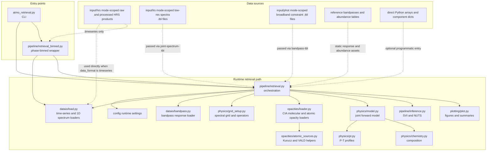

# atmo-retrieval

bayesian atmospheric retrieval for high-resolution exoplanet spectra

## install

```bash
pip install jax numpyro exojax astropy matplotlib corner
```

## Command-line workflows

```bash
# Prepare raw exposure folders for a transmission retrieval.
python -m dataio.prepare_retrieval_timeseries \
  --planet KELT-20b --epoch 20250601 --arm full --run-sysrem

# Prepare emission time-series retrieval inputs.
python -m dataio.prepare_emission_retrieval_timeseries \
  --planet KELT-20b --epoch 20250601 --arm full --run-sysrem

# Prepare the dedicated all-exposure source cubes for 1D retrievals.
python -m dataio.prepare_retrieval_timeseries \
  --planet KELT-20b --epoch 20250601 --arm full \
  --product-kind collapse-source --phase-bin all --run-sysrem
python -m dataio.prepare_emission_retrieval_timeseries \
  --planet KELT-20b --epoch 20250601 --arm full \
  --product-kind collapse-source --phase-bin all --run-sysrem

# Build the nightly 1D transmission spectrum.
python -m dataio.collapse_transmission_timeseries_to_1d \
  --planet KELT-20b --epoch 20250601 --arm full

# Build full, pre-eclipse, and post-eclipse nightly 1D emission spectra.
python -m dataio.collapse_emission_timeseries_to_1d \
  --planet KELT-20b \
  --epoch 20210501 20210518 20230430 20230615 20240516 \
  --arm full

# Combine only eligible pre-eclipse nightly spectra in one retrieval.
python -m atmo_retrieval \
  --planet KELT-20b --mode emission --data-format spectrum \
  --emission-selection pre_eclipse --wavelength-range full \
  --epoch 20210501 20210518 20230430 20230615 20240516

# Run either prepared time-series retrieval.
python -m atmo_retrieval --planet KELT-20b --mode transmission --epoch 20250601
```

The preparation step is unnecessary when the retrieval-ready time-series bundle
already exists.

Collapsed products require `collapse-source` cubes prepared with
`--phase-bin all`. Their saved collapse operators carry the frozen SYSREM basis
and apply it to each forward-model time series before exposure selection and
1D coaddition.

Mode-specific atmospheric defaults are explicit: transmission uses a
`1e-8`-`1` bar grid with a Guillot P-T profile, while emission uses a
`1e-4`-`1` bar grid with a p-spline P-T profile. Pass `--pt-profile` to override
the mode default for a run.

SVI is used as a warm start for NUTS/HMC. `--svi-only` outputs are approximate
diagnostics, not production posterior samples.

Low-resolution inputs are passed explicitly:
- use `--joint-spectrum-tbl path/to/file.tbl` for multi-bin low-res spectra
- use `--bandpass-tbl path/to/file.tbl` for single-band / sparse broadband constraints
- `--joint-spectrum-tbl` paths can be full paths or relative to `input/lrs`, canonical form `transmission/kelt9b/file.tbl` or `emission/kelt20b/file.tbl`
- `--bandpass-tbl` paths can be full paths or relative to `input/phot`, canonical form `transmission/kelt20b/file.tbl` or `emission/kelt9b/file.tbl`

## joint retrieval bandpass constraints

```bash
# bandpass constraints are added through pipeline.retrieval
# using build_bandpass_observation_config / bandpass_constraints
```

## code structure


```mermaid
flowchart TD
    subgraph EP[Entry points]
        A[atmo_retrieval.py<br/>CLI]
        M[pipeline/retrieval_binned.py<br/>phase-binned wrapper]
    end

    subgraph DS[Data sources]
        T1[input/hrs mode-scoped raw and processed HRS products]
        T2[input/lrs mode-scoped low-res spectra<br/>.tbl files]
        T3[input/phot mode-scoped broadband constraint .tbl files]
        T4[reference bandpasses and abundance tables]
        T5[direct Python arrays and component dicts]
    end

    subgraph RT[Runtime retrieval path]
        B[pipeline/retrieval.py<br/>orchestration]
        C[config runtime settings]
        D[dataio/load.py<br/>time-series and 1D spectrum loaders]
        D2[dataio/bandpass.py<br/>bandpass response loader]
        E[physics/grid_setup.py<br/>spectral grid and operators]
        F[opacities/loader.py<br/>CIA molecular and atomic opacity loaders]
        G[opacities/atomic_sources.py<br/>Kurucz and VALD helpers]
        H[physics/model.py<br/>joint forward model]
        I[physics/pt.py<br/>P-T profiles]
        J[physics/chemistry.py<br/>composition]
        K[pipeline/inference.py<br/>SVI and NUTS]
        L[plotting/plot.py<br/>figures and summaries]
    end

    A --> B
    A --> M
    M --> D
    M --> B

    B --> C
    B --> D
    B --> D2
    B --> E
    B --> F
    F --> G
    B --> H
    H --> I
    H --> J
    B --> K
    B --> L

    T1 -. used directly when data_format is timeseries .-> D
    T1 -. timeseries only .-> M
    T2 -. passed via joint-spectrum-tbl .-> B
    T3 -. passed via bandpass-tbl .-> B
    T4 -. static response and abundance assets .-> B
    T5 -. optional programmatic entry .-> B

```

- Solid arrows: normal code dependencies or execution flow.
- Dashed arrows: optional inputs or direct data sources.

modules:

```text
.
├── atmo_retrieval.py
├── config.py
├── config_utils.py
├── opacities
│   ├── __init__.py
│   ├── atomic_sources.py
│   └── loader.py
├── dataio
│   ├── bandpass.py
│   ├── load.py
│   ├── collapse_emission_timeseries_to_1d.py
│   ├── collapse_transmission_timeseries_to_1d.py
│   ├── prepare_emission_retrieval_timeseries.py
│   ├── prepare_retrieval_timeseries.py
│   └── tellurics.py
├── environment.yml
├── physics
│   ├── chemistry_draft.py
│   ├── chemistry.py
│   ├── grid_setup.py
│   ├── model.py
│   └── pt.py
├── pipeline
│   ├── inference.py
│   ├── memory_profile.py
│   ├── retrieval_binned.py
│   └── retrieval.py
├── plotting
│   ├── __init__.py
│   ├── aliasing.py
│   └── plot.py
```

## expected input directory structure

```
input/hrs/{mode}/{planet}/{epoch}/{arm}/
  timeseries/
    wavelength.npy
    data.npy
    sigma.npy
    phase.npy
    U_sysrem.npz
  collapse_source/
    wavelength.npy
    data.npy
    sigma.npy
    phase.npy
    U_sysrem.npz
  collapsed/full_transit/
    wavelength_transmission.npy
    spectrum_transmission.npy
    uncertainty_transmission.npy
    transmission_collapse_operator.npz
  collapsed/{full_emission,pre_eclipse,post_eclipse}/
    wavelength_emission.npy
    spectrum_emission.npy
    uncertainty_emission.npy
    emission_collapse_operator.npz
    collapse_metadata.json

input/hrs/{mode}/raw/{planet}/{epoch}/
  ... raw PEPSI files ...

input/lrs/{mode}/{planet}/
  *.tbl
  {spec_num}/
    wavelength_{mode}.npy
    spectrum_{mode}.npy
    uncertainty_{mode}.npy
    metadata.json

input/lrs/{mode}/raw/{planet}/
  hst_wfc3_ir_g102_pid17082/
    IF0L02RCQ/
      if0l02rcq_flt.fits
      ...
  ... other source archive bundles / auxiliary tables ...

input/phot/{mode}/{planet}/
  *.tbl

input/phot/{mode}/raw/{planet}/
  ... cadence-level photometry or upstream fit products ...

reference/bandpasses/
  tess-response-function-v2.0.csv

reference/abundances/
  asplund_2020_extended.dat

cache/phoenix/
cache/opacity/

db/
  hitemp/
  exomol/
  exoatom/
  kurucz/
  vald/
  cia/
```

## outputs

```
output/{planet}/{ephemeris}/{mode}/{timestamp}/
  run_config.log
  mcmc_summary.txt
  posterior_sample.npz
  atmospheric_state.npz
  contribution_function.pdf
```
