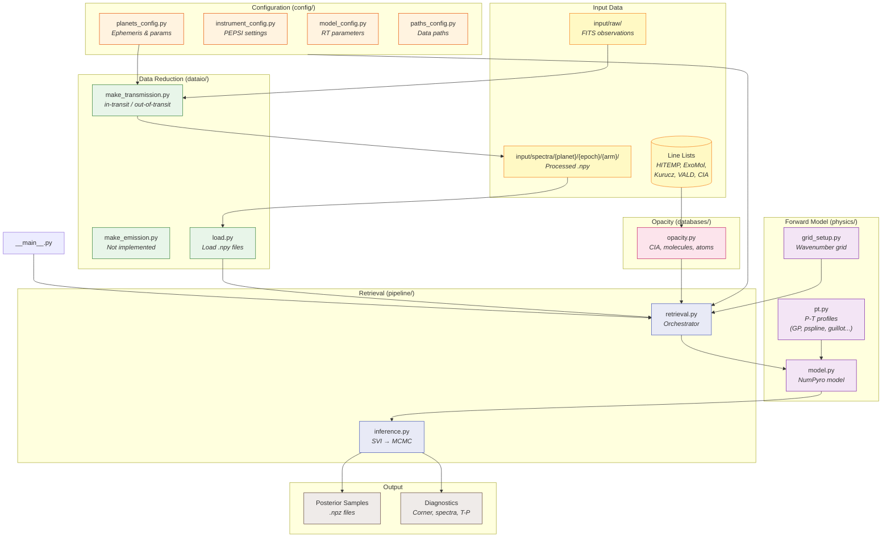

# Atmospheric Retrieval

Bayesian atmospheric retrieval for exoplanet transmission and emission spectra.

## Architecture

```mermaid
flowchart TB
    subgraph Input["Input Data"]
        raw["input/raw/<br/><i>FITS observations</i>"]
        spectra["input/spectra/{planet}/{epoch}/{arm}/<br/><i>Processed .npy</i>"]
        db[("Line Lists<br/><i>HITEMP, ExoMol,<br/>Kurucz, VALD, CIA</i>")]
    end

    subgraph Config["Configuration (config/)"]
        planets["planets_config.py<br/><i>Ephemeris & params</i>"]
        instrument["instrument_config.py<br/><i>PEPSI settings</i>"]
        model_cfg["model_config.py<br/><i>RT parameters</i>"]
        paths["paths_config.py<br/><i>Data paths</i>"]
    end

    subgraph DataIO["Data Reduction (dataio/)"]
        make_trans["make_transmission.py<br/><i>in-transit / out-of-transit</i>"]
        make_emis["make_emission.py<br/><i>Not implemented</i>"]
        load["load.py<br/><i>Load .npy files</i>"]
    end

    subgraph Physics["Forward Model (physics/)"]
        model["model.py<br/><i>NumPyro model</i>"]
        pt["pt.py<br/><i>P-T profiles<br/>(GP, pspline, guillot...)</i>"]
        grid["grid_setup.py<br/><i>Wavenumber grid</i>"]
    end

    subgraph Opacity["Opacity (databases/)"]
        opa["opacity.py<br/><i>CIA, molecules, atoms</i>"]
    end

    subgraph Pipeline["Retrieval (pipeline/)"]
        retrieval["retrieval.py<br/><i>Orchestrator</i>"]
        inference["inference.py<br/><i>SVI → MCMC</i>"]
    end

    subgraph Output["Output"]
        posterior["Posterior Samples<br/><i>.npz files</i>"]
        plots["Diagnostics<br/><i>Corner, spectra, T-P</i>"]
    end

    %% Data reduction flow
    raw --> make_trans
    planets --> make_trans
    make_trans --> spectra

    %% Main retrieval flow
    CLI["__main__.py"] --> retrieval
    Config --> retrieval

    spectra --> load
    load --> retrieval
    db --> opa
    opa --> retrieval
    grid --> retrieval

    retrieval --> model
    pt --> model
    model --> inference

    inference --> posterior
    inference --> plots

    %% Styling
    classDef input fill:#fff9c4,stroke:#f57f17
    classDef config fill:#fff3e0,stroke:#e65100
    classDef dataio fill:#e8f5e9,stroke:#2e7d32
    classDef physics fill:#f3e5f5,stroke:#7b1fa2
    classDef opacity fill:#fce4ec,stroke:#c2185b
    classDef pipeline fill:#e8eaf6,stroke:#3f51b5
    classDef output fill:#efebe9,stroke:#5d4037

    class raw,spectra,db input
    class planets,instrument,model_cfg,paths config
    class make_trans,make_emis,load dataio
    class model,pt,grid physics
    class opa opacity
    class retrieval,inference pipeline
    class posterior,plots output
```
