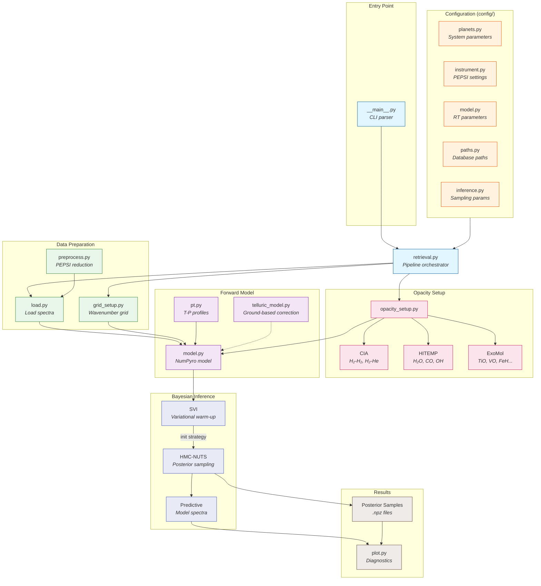

This codebase performs Bayesian atmospheric retrieval on transmission and/or emission spectra of ultra-hot Jupiters, specifically designed for KELT-20b observations with PEPSI/LBT.

## Architecture



### Data Flow Summary

1. **Configuration** → Load planet parameters, instrument settings, and sampling hyperparameters
2. **Data Preparation** → Load observed spectrum, build high-resolution wavenumber grid
3. **Opacity Setup** → Load/compute CIA and molecular cross-sections (cached as `.zarr`)
4. **Forward Model** → NumPyro probabilistic model: T-P profile → opacities → radiative transfer → spectrum
5. **Inference** → SVI warm-up finds good initialization, then HMC-NUTS samples the posterior
6. **Output** → Posterior samples, predictive spectra, and diagnostic plots

## Quick Start

```bash
# Run transmission retrieval
python __main__.py --mode transmission

# Quick test (100 samples)
python __main__.py --quick

# See all options
python __main__.py --help
```

## Modules

```
├── config/                # Configuration package
│   ├── planets.py         #   Planet/system parameters from literature
│   ├── instrument.py      #   Spectrograph settings (PEPSI/LBT)
│   ├── model.py           #   RT and spectral grid parameters
│   ├── paths.py           #   Database paths and output directories
│   └── inference.py       #   SVI and MCMC sampling parameters
├── load.py                # Data loading (PEPSI, JWST formats)
├── preprocess.py          # PEPSI data preprocessing
├── grid_setup.py          # Wavenumber grid and spectral operators
├── opacity_setup.py       # CIA, molecular, atomic opacities
├── model.py               # NumPyro model for HRCCS retrieval
├── transmission_model.py  # Transmission forward model
├── emission_model.py      # Emission forward model
├── telluric_model.py      # Telluric absorption (ground-based)
├── inference.py           # SVI and HMC-NUTS
├── plot.py                # Visualization
├── retrieval.py           # Retrieval pipeline functions
└── __main__.py            # CLI entry point
```

## Configuration

Configuration is split into logical modules under `config/`:

- **planets.py**: Planet parameters from published literature with ephemeris source tracking
  - `PLANET` and `EPHEMERIS` select the active target
  - `get_params()` returns parameters for the current planet/ephemeris
  - Supports multiple ephemeris sources per planet (e.g., "Duck24", "Talens18")

- **instrument.py**: Spectrograph and observatory settings
  - `RESOLUTION`, `OBSERVING_MODE`, wavelength ranges
  - FITS header key mappings and file patterns

- **model.py**: Radiative transfer parameters
  - Pressure/temperature ranges, atmospheric layers
  - Spectral grid resolution, cloud parameters

- **paths.py**: Database and output paths
  - HITEMP, ExoMol, Kurucz database locations
  - Input/output directory structure

- **inference.py**: Sampling parameters
  - SVI steps and learning rate
  - MCMC warmup, samples, chains

All settings are re-exported from `config/__init__.py` for convenience:
```python
from config import PLANET, get_params, RESOLUTION, NLAYER
```

## Dependencies

```bash
jax
numpyro
exojax
numpy
matplotlib
corner
astropy
arviz (optional, for diagnostics)
```
